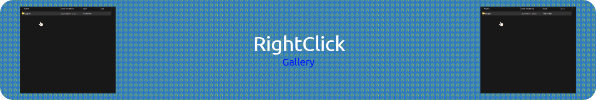
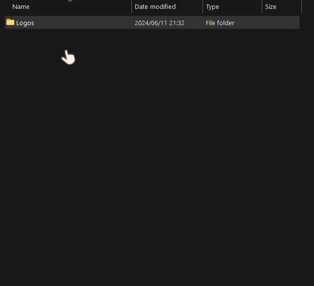

This Python script creates a simple image gallery using Tkinter, displaying thumbnails of images from a specified folder.

## Status

# Why would you want to use this?

This script is a lifesaver for those of us whose folders resemble a chaotic jumble of mislaid files and unsorted downloads. If you're like me and dread the idea of meticulously organizing every folder or constantly switching your Windows folder view from details to thumbnails just to find a picture, then this script is your new best friend. With a simple right-click on any folder, you can summon forth an instant gallery of images, sparing you the agony of sifting through the digital equivalent of a cluttered attic. So go ahead, embrace the chaos, and let the "Open Image Gallery" option rescue you from folder mayhem with a touch of tech-savvy whimsy.

## Prerequisites

- Python 3.x
- Tkinter
- Pillow (PIL)

## Functionality

- The script creates a window displaying thumbnails of images   found in the specified folder.
- Images are resized to fit a square of 100x100 pixels each.
- Supported image formats include PNG, JPG, JPEG, GIF, and BMP.

## Usage

Simply run `.\install.ps1`

### What do these files do?

#### **install.ps1**

The PowerShell script creates a registry entry to add a custom context menu option called "Open Image Gallery" when right-clicking on folders in Windows Explorer. This option executes a Python script to open an image gallery, with necessary setup including copying files, checking Python environment, installing dependencies, and executing registry modifications.

#### **image_gallery**

This Python script creates a simple image gallery using Tkinter, displaying thumbnails of images from a specified folder. It resizes images to thumbnails, arranges them in a grid layout, and opens a window to showcase the gallery.

## Example

